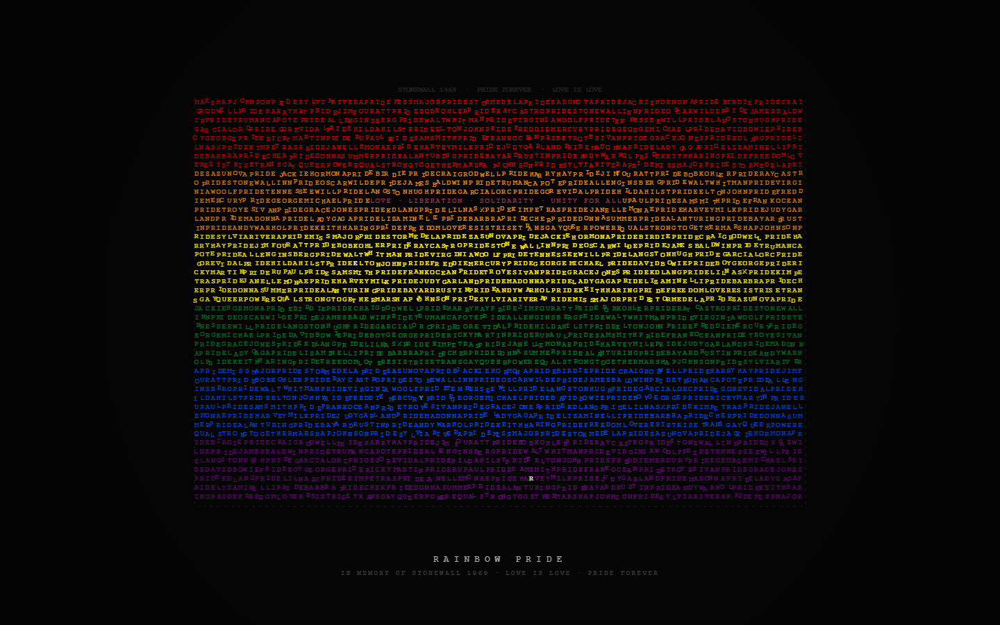
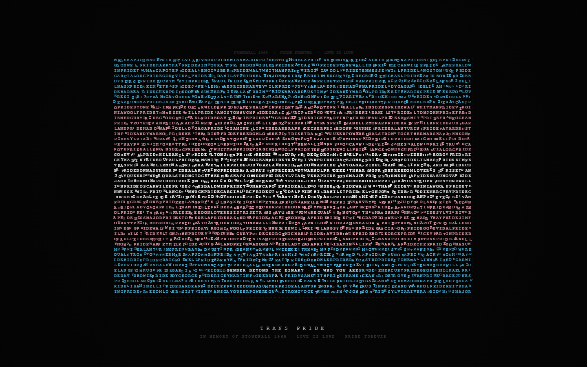
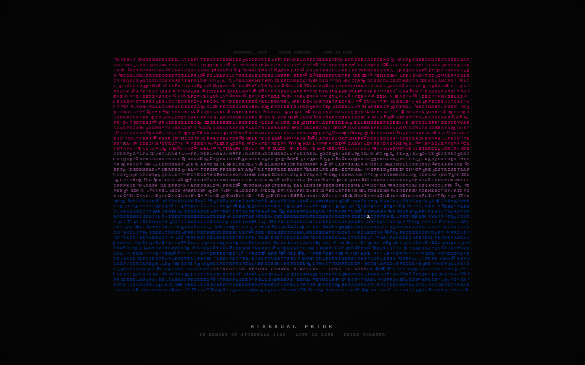
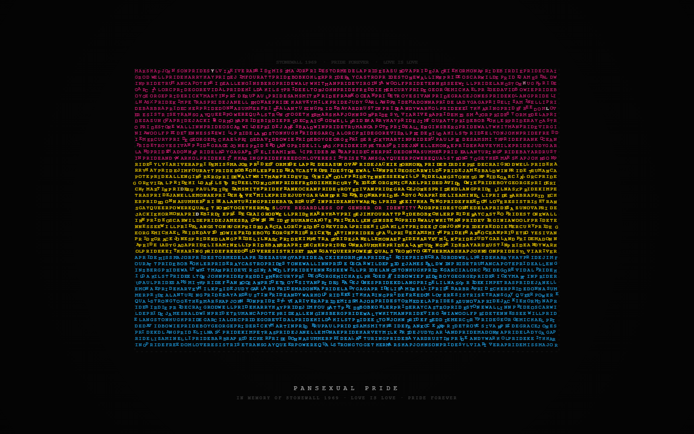
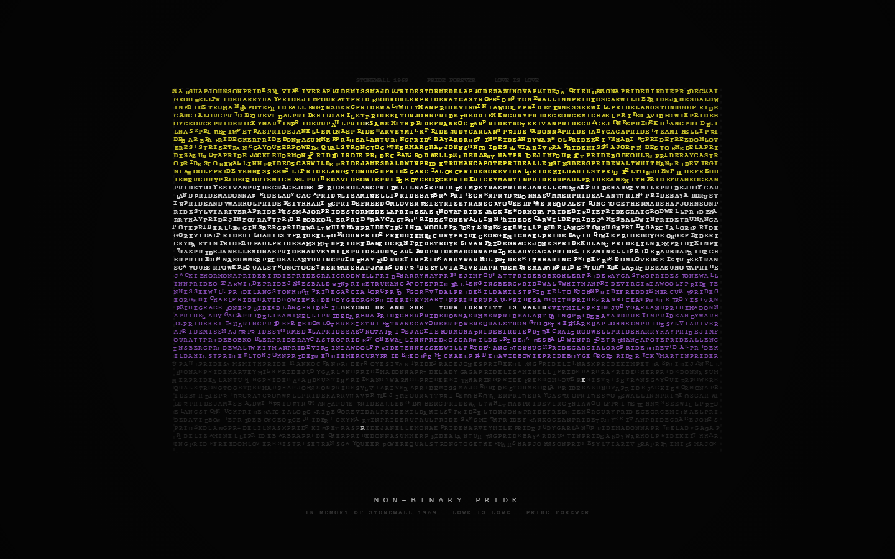
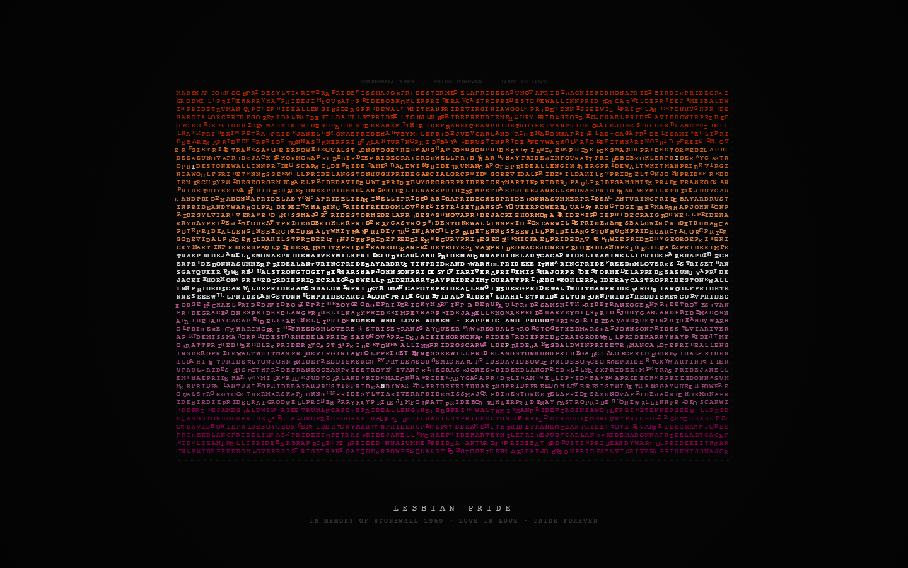
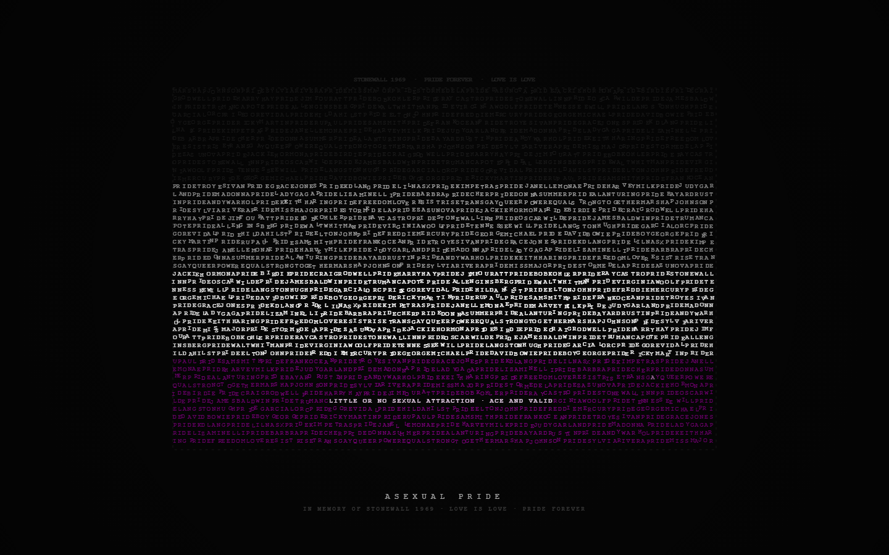
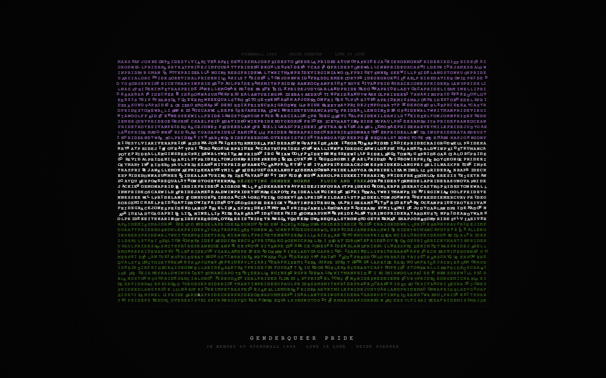

<div align="center">

# ✦ PRIDE — Web Art Installation

### *An interactive digital memorial celebrating the LGBTQIA+ movement through living typography*

[](https://github.com/viniciussilva2504/Pride_Web_Art_Installation)
[](./LICENSE)
[](https://developer.mozilla.org/en-US/docs/Web/JavaScript)
[](https://developer.mozilla.org/en-US/docs/Web/API/Canvas_API)
[](#)

<br/>

> *"Every letter you see is a name. Every name is a story. Every story is PRIDE."*

<br/>


</div>

---

## Gallery

<div align="center">

| | |
|:---:|:---:|
|  |  |
| *🏳️‍🌈 Rainbow Pride* | *🏳️‍⚧️ Trans Pride* |
|  |  |
| *Bisexual Pride* | *Pansexual Pride* |
|  |  |
| *Non-Binary Pride* | *Lesbian Pride* |
|  |  |
| *Asexual Pride* | *Genderqueer Pride* |

</div>

---

## What is this?

**PRIDE — Web Art Installation** is a zero-dependency, browser-native art piece that transforms the names of LGBTQIA+ heroes, activists, and icons into a living, animated particle field — visually forming each pride flag as an act of remembrance.

Every particle on screen is a letter. Every letter belongs to a name. The names are those of people who fought, marched, resisted, created, and loved — from the Stonewall uprising of 1969 to today's artists and pop icons.

The installation cycles through **8 official LGBTQIA+ pride flags**, each revealing its own definition in a contrasting typographic overlay, before gently transitioning to the next.

Designed to be embedded anywhere — a website header, a gallery wall, an event screen, a pride month campaign — with no external libraries and a single `<script>` tag.

---

## ✦ Features

| Feature | Description |
|---|---|
| **Living Typography** | The entire canvas is composed of letter-particles — names of activists, artists, and icons |
| **8 Pride Flags** | Rainbow · Trans · Bisexual · Pansexual · Non-Binary · Lesbian · Asexual · Genderqueer |
| **Organic Transitions** | Smooth colour crossfades with per-letter random timing — no two transitions look alike |
| **Letter Dance** | During display, each letter has its own sinusoidal movement frequency — subtle, breathing motion |
| **Flag Definitions** | Each flag reveals its identity definition as a typographic inscription within a contrasting stripe |
| **Sparse Spark Effect** | Random letters flash white across the flag, like stars catching light |
| **Memorial Tribute** | Stonewall 1969 heroes and 40+ LGBTQIA+ icons are encoded into the source text |
| **Fully Responsive** | Redraws on resize — works on any screen size, from mobile to projection wall |
| **Zero Dependencies** | Pure HTML5 Canvas + Vanilla JS — no frameworks, no build step, no npm |

---

## ✦ The Flags

| Flag | Definition |
|---|---|
| 🏳️‍🌈 **Rainbow Pride** | Love · Liberation · Solidarity · Unity For All |
| 🏳️‍⚧️ **Trans Pride** | Gender Beyond The Binary · Be Who You Are |
| **Bisexual Pride** | Attraction Beyond Gender Binaries · Love Is Love |
| **Pansexual Pride** | Love Regardless Of Gender Or Identity |
| **Non-Binary Pride** | Beyond He And She · Your Identity Is Valid |
| **Lesbian Pride** | Women Who Love Women · Sapphic And Proud |
| **Asexual Pride** | Little Or No Sexual Attraction · Ace And Valid |
| **Genderqueer Pride** | Rejecting Gender Norms · Fluid And Free |

---

## ✦ Heroes Encoded in the Particle Field

The source text powering every letter on screen is composed of the names of those who made the movement possible:

<details>
<summary><strong>Stonewall 1969 — The Uprising</strong></summary>

> Marsha P. Johnson · Sylvia Rivera · Miss Major Griffin-Gracy · Zazu Nova  
> Stormé DeLarverie · Jackie Hormona · Birdie Rivera · Craig Rodwell  
> Bob Kohler · Ray Castro · Harry Hay · Jim Fouratt

</details>

<details>
<summary><strong>Writers, Poets & Intellectuals</strong></summary>

> Oscar Wilde · James Baldwin · Truman Capote · Allen Ginsberg  
> Walt Whitman · Virginia Woolf · Tennessee Williams · Langston Hughes  
> Federico García Lorca · Gore Vidal · Hilda Hilst

</details>

<details>
<summary><strong>Musicians & Pop Icons</strong></summary>

> Elton John · Freddie Mercury · George Michael · David Bowie · Boy George  
> Ricky Martin · RuPaul · Sam Smith · Frank Ocean · Troye Sivan  
> Grace Jones · kd lang · Lil Nas X · Kim Petras · Janelle Monáe

</details>

<details>
<summary><strong>Cultural Icons & Divas</strong></summary>

> Judy Garland · Madonna · Lady Gaga · Liza Minnelli · Barbra Streisand  
> Cher · Donna Summer · Alan Turing · Bayard Rustin  
> Andy Warhol · Keith Haring · Harvey Milk

</details>

---

## ✦ Technical Architecture

```
Pride_Web_Art_Installation/
├── index.html      # Single-page entry point — minimal markup
├── style.css       # Full-screen canvas layout + UI label styling
└── pride.js        # Entire animation engine (~550 lines, zero deps)
```

### How the Engine Works

```
1. SOURCE TEXT     Names of heroes concatenated into a looping string
       ↓
2. PARTICLE GRID   Each cell of the flag grid becomes one letter-particle
       ↓
3. TRANSITION      Per-particle random colour speed + subtle horizontal drift (10–25%)
       ↓
4. DISPLAY         Organic sinusoidal dance (individual frequency per letter)
                   + flag definition inscribed in a high-contrast stripe
                   + sparse white spark effect
       ↓
5. LOOP            8 flags cycle continuously, ~11s per flag
```

### Key Implementation Details

- **Rendering**: HTML5 Canvas 2D — all text drawn with `fillText()` at 10px Courier New
- **Colour Model**: Per-particle RGB lerp with individual random speeds (`colorSpeed: 0.018–0.070`)
- **Dance Motion**: Per-particle sinusoidal offset `sin(ts × freq + phase) × amp`, X and Y independent
- **Definition Text**: Centred in the middle row of the most high-contrast stripe; uses luminance-based colour selection (`0.2126R + 0.7152G + 0.0722B`)
- **Vignette**: Radial gradient overlay for cinematic framing
- **Responsiveness**: Full layout recomputed on `resize` event

---

## ✦ Quick Start

### Option 1 — Clone and open locally

```bash
git clone https://github.com/viniciussilva2504/Pride_Web_Art_Installation.git
cd Pride_Web_Art_Installation
# Open index.html directly in your browser — no server needed
```

### Option 2 — Embed in any HTML page

Copy the three files into your project and add:

```html
<!-- In your <head> -->
<link rel="stylesheet" href="pride/style.css" />

<!-- Before </body> -->
<canvas id="c"></canvas>
<div id="ui">
  <div id="flag-name"></div>
  <div id="sub">IN MEMORY OF STONEWALL 1969 · LOVE IS LOVE · PRIDE FOREVER</div>
</div>
<script src="pride/pride.js"></script>
```

### Option 3 — Deploy to Vercel / Netlify

```bash
# Vercel
npx vercel --prod

# Netlify drag-and-drop
# Upload the project folder at netlify.com/drop
```

---

## ✦ Customization

### Add a new pride flag

```js
// In pride.js → FLAGS array
{
  name: "INTERSEX PRIDE",
  definition: "BORN WITH VARIATIONS IN SEX CHARACTERISTICS",
  colors: ["#FFD800", "#7902AA"],
}
```

### Pin a flag definition to a specific stripe

```js
{
  name: "CUSTOM FLAG",
  definition: "YOUR DEFINITION HERE",
  defStripe: 1,       // 0-indexed — forces definition to stripe index 1
  colors: ["#...", "#...", "#..."],
}
```

### Adjust animation timing

```js
// In pride.js
const DUR = {
  transition: 2600,   // ms — colour crossfade between flags
  display:    8200,   // ms — time each flag is shown
};
```

### Change letter density / size

```js
const FONT_SIZE = 10;   // px — glyph size
const GX = 7.9;         // horizontal cell spacing
const GY = 12.9;        // vertical cell spacing
```

---

## ✦ Use Cases

- **Pride Month campaigns** — drop into any website as a full-screen or section background
- **Event displays** — project on a wall at LGBTQIA+ events, conferences, cultural spaces
- **Gallery installations** — loop on a monitor or screen as a digital art piece
- **Portfolio projects** — demonstrates advanced Canvas animation without any framework
- **Educational context** — each flag and definition can spark conversation about LGBTQIA+ identities

---

## ✦ Browser Support

| Browser | Support |
|---|---|
| Chrome 90+ | ✅ Full |
| Firefox 88+ | ✅ Full |
| Safari 14+ | ✅ Full |
| Edge 90+ | ✅ Full |
| Mobile (iOS / Android) | ✅ Responsive |

> No WebGL, no workers, no special APIs — just Canvas 2D and `requestAnimationFrame`.

---

## ✦ License

This project is licensed under the **MIT License** — you are free to use, embed, modify, and redistribute it, including for commercial pride campaigns and events.

See [LICENSE](./LICENSE) for full terms.

---

## ✦ Author

<div align="center">

**Vinicius Silva**  
Frontend Developer · React · TypeScript · Canvas · Porto, Portugal

[](https://portfolio-ebon-nine-95.vercel.app)
[](https://www.linkedin.com/in/vjsilva2504/)
[](https://github.com/viniciussilva2504)

*Architecture background turned Frontend Developer — building things that are both functional and beautiful.*

</div>

---

<div align="center">

**In memory of everyone who marched, fought, and loved before it was safe to do so.**  
*Stonewall 1969 · PRIDE FOREVER*

</div>
